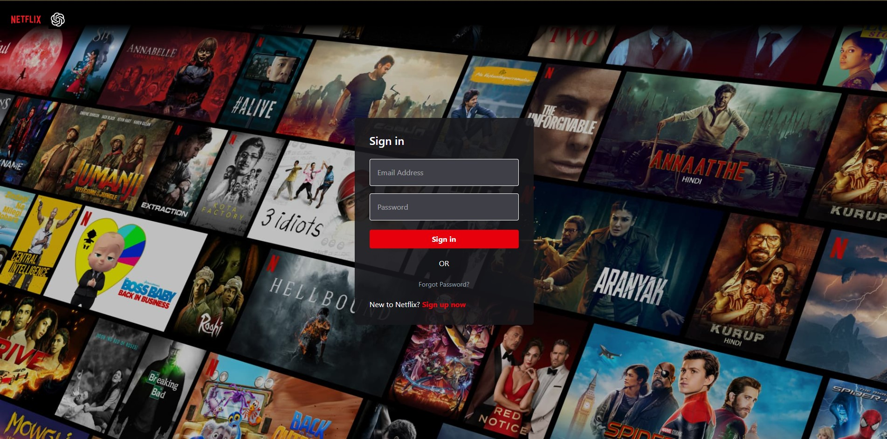
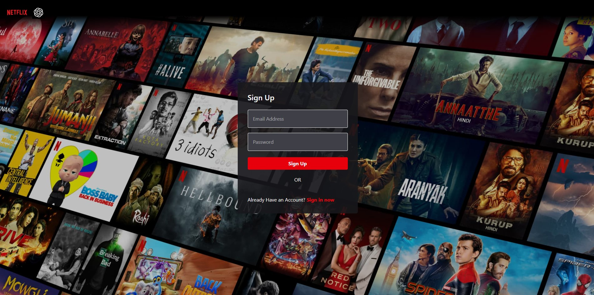
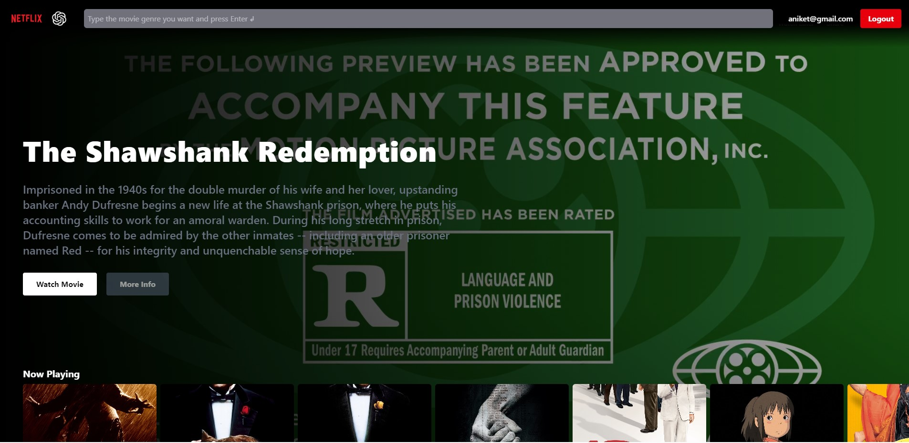
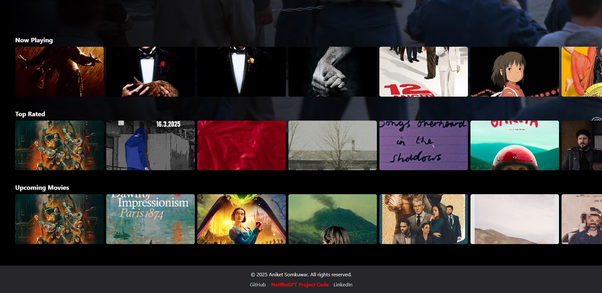
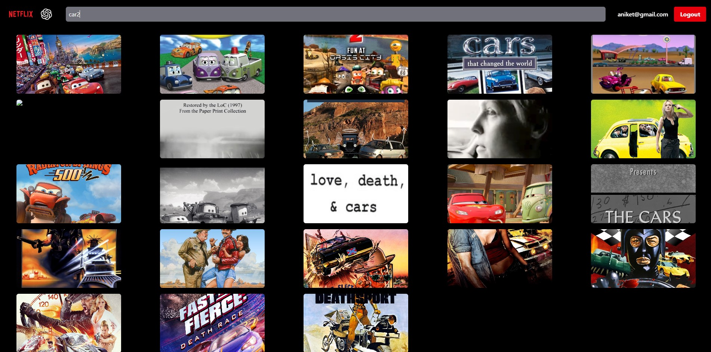

# Netflix GPT - Movie Discovery App

## Sign In Page

## Sign Up Page

## Main Pages

## Search Page

This project is a Netflix-inspired movie browsing application, leveraging React, Redux, Firebase, and the TMDB API to provide a seamless and engaging user experience.

## Project Setup

- **Vite:** Utilized Vite for rapid development and build processes.
- **Tailwind CSS:** Employed Tailwind CSS for efficient and responsive styling.
- **Structured Architecture:**
  - `Pages`: Houses distinct application views.
  - `Components`: Contains reusable UI components.
  - `Utils`: Stores utility functions and constants.
  - `hooks`: Contains custom hooks for data fetching and other functionalities.
- **React Router v6:** Implemented React Router v6 for smooth client-side navigation.

## Core Features

### Enhanced Authentication

- **Unified Authentication Form:** Integrated a single component for both sign-in and sign-up, streamlining the user experience.
- **Robust Form Validation:** Implemented comprehensive form validation with detailed error handling for improved user feedback.
- **`useRef` Hook:** Leveraged the `useRef` hook for efficient form interaction and manipulation.
- **Firebase Authentication Integration:**
  - User registration and account creation.
  - Secure user login and logout functionalities.
  - Profile username updates to personalize user accounts.
- **Redux User Slice:** Created a Redux store with a dedicated User Slice for centralized user state management.
- **`useNavigate` Hook:** Utilized the `useNavigate` hook for seamless page redirection after authentication events.
- **`onAuthStateChanged` Cleanup:** Implemented proper unsubscription from the `onAuthStateChanged` callback upon logout to prevent memory leaks and ensure efficient resource management.

### Dynamic Movie Browsing

- **TMDB API Integration:** Registered on TMDB and fetched comprehensive movie data via API for a rich movie browsing experience.
- **Browse Page Functionality:**
  - **Main Movie Section:**
    - Dynamic background trailer integration using the YouTube API, creating an immersive experience.
    - Clear display of movie titles and descriptions for quick information access.
  - **Categorized Movie Lists:**
    - Organized movies into categories such as popular, upcoming, and more for easy navigation.
    - Developed reusable **Movie Cards** for consistent and user-friendly browsing.
- **Custom `useFetchTrailer` Hook:** Created a custom hook to efficiently fetch and manage movie trailers, improving performance and code organization.
- **Search Functionality:**
  - Implemented a search page that uses Google's Gemini API to get movie titles based on a search query.
  - Searched movies are displayed using the TMDB API.
  - Implemented a search limit of 5 searches per user.
- **Redux Movie Slice:** Created a Redux store with a dedicated Movie slice for centralized movie data management.
  - Added searched movies and popular movies to the Redux store.
  - Added upcoming movies to the Redux store.
- **Loading Indicators:** Added loading indicators to the search page.

## Future Enhancements

- Custom hooks for streamlined sign-in and sign-up logic to further improve code organization and reusability.
- Advanced movie filtering options based on ratings to enhance user search capabilities.
- Implement responsive design for mobile devices.
- Add more categories to browse page.
- Add movie details page.
- Add user profile page.

---

Built with ❤️ using React, Redux, Firebase, and TMDB API.
